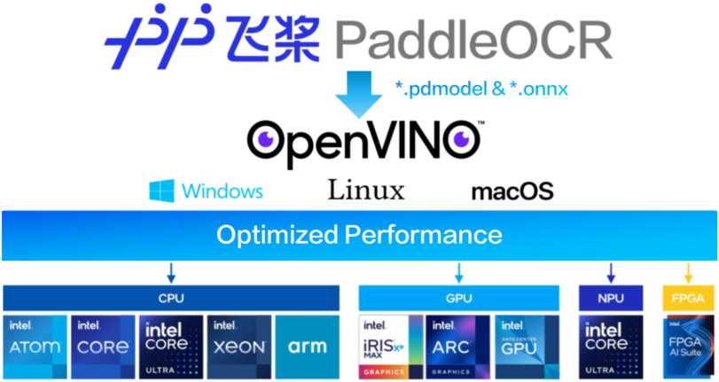
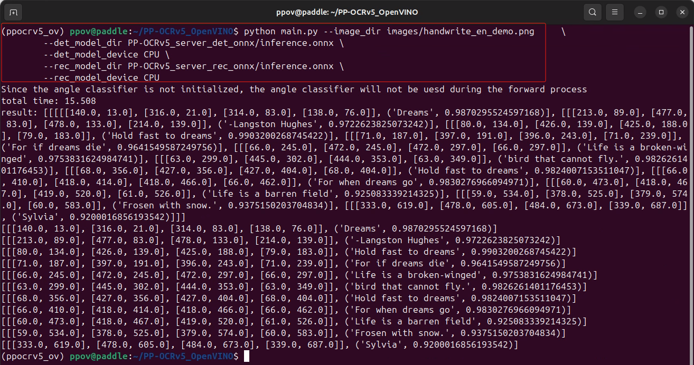

# PP-OCRv5_OpenVINO
<div style="text-align: center;">
    
</div>

## Introduction
🔥PP-OCRv5_OpenVINO is a demo project that demonstrates how to perform inference using the [PP-OCRv5](https://github.com/PaddlePaddle/PaddleOCR)  model with [OpenVINO](https://docs.openvino.ai/2025/index.html). The [PP-OCRv5](https://github.com/PaddlePaddle/PaddleOCR) model is a High-Accuracy Text Recognition Model for All Scenarios:

   1. 🌐 Single-model support for **five** text types - Seamlessly process **Simplified Chinese, Traditional Chinese, Simplified Chinese Pinyin, English** and **Japanse** within a single model.
   2. ✍️ Improved **handwriting recognition**: Significantly better at complex cursive scripts and non-standard handwriting.
   3. 🎯 **13-point accuracy gain** over PP-OCRv4, achieving state-of-the-art performance across a variety of real-world scenarios.

**Run** PP-OCRv5 demo on [HuggingFace](https://huggingface.co/spaces/PaddlePaddle/PP-OCRv5_Online_Demo) directly, or run it locally as below.

## Installation
To install the necessary dependencies for this project, follow these steps:

1. Clone the repository:
    ```bash
    git clone https://github.com/openvino-book/PP-OCRv5_OpenVINO.git
    cd PP-OCRv5_OpenVINO
    ```

2. Create a virtual environment and activate it:
    ```bash
    conda create -n ppocrv5_ov python=3.11
    conda activate ppocrv5_ov
    ```

3. Install the required packages:
    ```bash
    pip install -r requirements.txt
    ```

4. Convert the PP-OCRv5 Model to ONNX format in the PP-OCRv4_OpenVINO folder as [《How to export PP-OCRv5 model to ONNX format》](./How%20to%20export%20PP-OCRv5%20model.md)


## Quick Start
To quickly start using the PP-OCRv4_OpenVINO project, follow these steps:

1. Run the inference script:
    ```sh
    python main.py --image_dir images/handwrite_en_demo.png     \
        --det_model_dir PP-OCRv5_server_det_onnx/inference.onnx \
        --det_model_device CPU \
        --rec_model_dir PP-OCRv5_server_rec_onnx/inference.onnx \
        --rec_model_device CPU

    ```

2. The recognized text will be printed to the console.


3. Compare the inference performance with the [official data](https://www.paddleocr.ai/latest/en/version3.x/algorithm/PP-OCRv5/PP-OCRv5.html).

## Support other inference engines
Refer to [How to Support Other Inference Engines](./How%20to%20support%20other%20inference%20engines.md)

## Learn more about OpenVINO
Go to the [OpenVINO Handbook](https://github.com/openvino-book/openvino_handbook)

## License
This project is licensed under the MIT License. See the [LICENSE](LICENSE) file for more details.

## Acknowledgment
This project is based on the PP-OCRv4 model from [PaddleOCR](https://github.com/PaddlePaddle/PaddleOCR) and most of inference code comes from [OnnxOCR](https://github.com/jingsongliujing/OnnxOCR). We would like to thank the PaddleOCR team and @[jingsongliujing](https://github.com/jingsongliujing) for their contributions to the OCR community.
